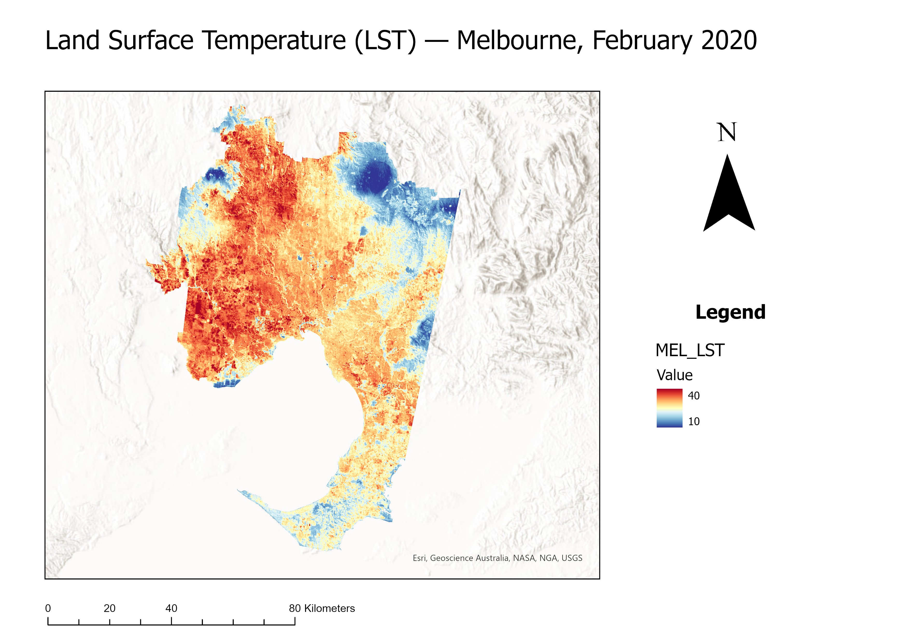
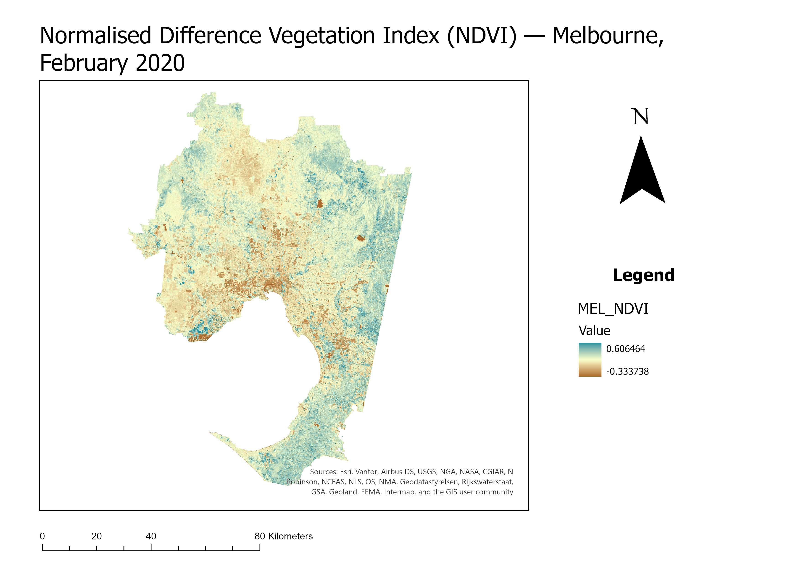

# Urban Heat Island Analysis — Melbourne
### Land Surface Temperature Mapping using Landsat 8 Thermal Remote Sensing

**Author:** Luke Kennedy
**Date:** June 2026
**Tools:** ArcGIS Pro, USGS EarthExplorer
**Data:** Landsat 8 Collection 2 Level-1 (USGS), ABS Greater Melbourne Boundary (GCCSA)

---

## Overview

This project derives and analyses Land Surface Temperature (LST) across western and
central Greater Melbourne using Landsat 8 Band 10 thermal infrared imagery. A six-step
processing chain was implemented in ArcGIS Pro Spatial Analyst to quantify surface
temperature variation across the metropolitan area, identifying urban heat island
patterns and the moderating role of vegetation and water bodies.

The scene used is **23 February 2020**, capturing Melbourne's late-summer thermal peak.
The study area is clipped to the Greater Capital City Statistical Area (GCCSA) boundary,
though the Landsat scene footprint (LC08_L1TP_092086_20200223) covers the western and
central portions of Greater Melbourne only — eastern suburbs and the Dandenong Ranges
fringe fall outside the scene extent and are excluded from this analysis.

---

## Methodology

The following six-step processing chain was applied in ArcGIS Pro Spatial Analyst
Raster Calculator:

| Step | Output | Formula |
|------|--------|---------|
| 1 | TOA Radiance | `L = 0.0003342 × B10 + 0.1` |
| 2 | Brightness Temperature | `BT = 1321.0789 / Ln(774.8853 / L + 1) − 273.15` |
| 3 | NDVI | `(B5 − B4) / (B5 + B4)` |
| 4 | Proportion of Vegetation | `Pv = Square((NDVI − NDVImin) / (NDVImax − NDVImin))` |
| 5 | Land Surface Emissivity | `LSE = 0.004 × Pv + 0.986` |
| 6 | Land Surface Temperature | `LST = BT / (1 + (0.00115 × BT / 1.4388) × Ln(LSE))` |

Thermal constants: K1 = 774.8853, K2 = 1321.0789 (Landsat 8 Band 10).
All processing conducted at 30m spatial resolution.

---

## Data Sources

- **Landsat 8 OLI/TIRS Collection 2 Level-1** — USGS EarthExplorer (earthexplorer.usgs.gov)
  - Scene: LC08_L1TP_092086_20200223
  - Bands used: Band 4 (Red), Band 5 (NIR), Band 10 (TIR)
- **Greater Melbourne Boundary (GCCSA)** — Australian Bureau of Statistics (abs.gov.au)

---

## Key Findings

- LST ranged from **13.24°C to 37.80°C** across the study area in February 2020 —
  a thermal range of 24.56°C within the western and central metropolitan footprint
- Melbourne's western growth corridors (Sunshine, Werribee, Melton) record the
  highest surface temperatures, driven by high impervious surface density and
  limited canopy cover
- **Port Phillip Bay** exerts the most spatially prominent cooling effect in the
  scene, with LST values along the foreshore well below the surrounding urban fabric
- A large cool zone in the northern portion of the scene corresponds to forested
  areas north of Melbourne's urban boundary (Kinglake / Toolangi State Forest),
  where dense vegetation and elevation suppress surface temperatures
- The **Yarra River corridor** produces a visible linear cooling effect through
  the inner suburbs
- NDVI is a strong inverse predictor of LST — suburbs with higher vegetation
  fraction show measurably lower surface temperatures
- Eastern suburbs (Kew, Hawthorn, Frankston) and the Dandenong Ranges fall
  outside the scene footprint and are not captured in this analysis

---

## Map Outputs

### Land Surface Temperature — Melbourne, February 2020


### NDVI — Melbourne, February 2020


---

## Policy Context

Melbourne faces a well-documented urban heat challenge. The **City of Melbourne
Urban Forest Strategy** (40% canopy cover target by 2040) and the **Victorian
Urban Cooling Strategy** both identify surface temperature reduction as a priority.
This analysis provides spatial evidence of the heat distribution across Melbourne's
western and central suburbs, supporting the case for targeted greening and cool
surface interventions in the city's most heat-exposed growth corridors.

---

## Limitations

- The Landsat scene footprint does not fully cover the Greater Melbourne GCCSA
  boundary — eastern suburbs and the Dandenong Ranges fringe are excluded.
  A complete metropolitan analysis would require mosaicking an adjacent scene tile
- Landsat 8 Band 10 is resampled from 100m native resolution to 30m, introducing
  sub-pixel averaging that may smooth fine-scale thermal variation
- Single-date snapshot only — does not account for diurnal or inter-annual variability
- Simplified emissivity model (two-endmember approach); no full atmospheric correction

---

## Repository Structure

```
/outputs        ← exported map images (PNG, 300 DPI)
/docs           ← PDF report
README.md
```

---

## Full Report

A complete PDF report structured as a professional consultant deliverable is
available in the `/docs` folder.
